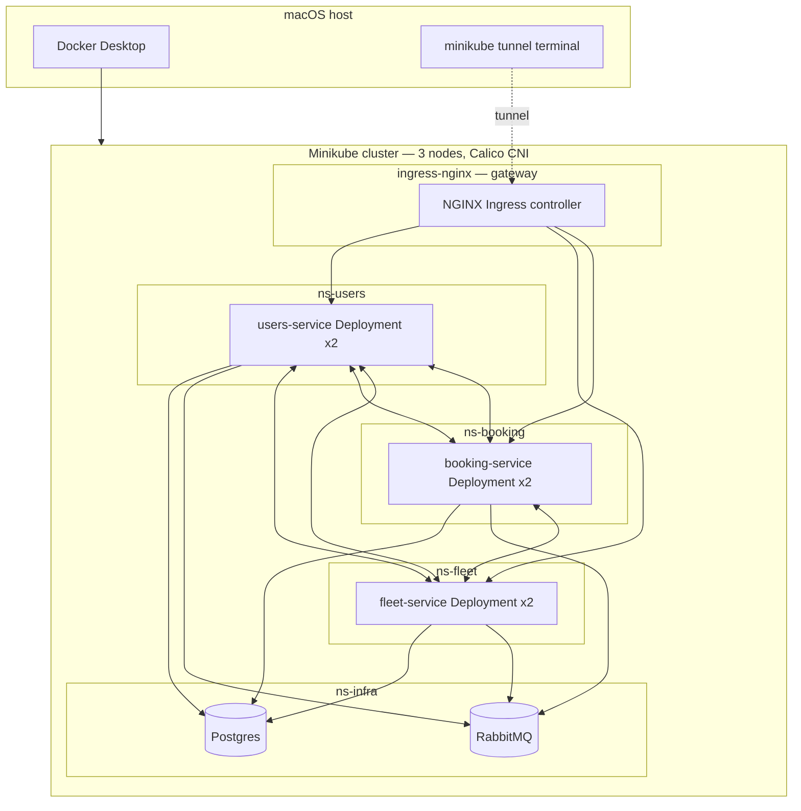
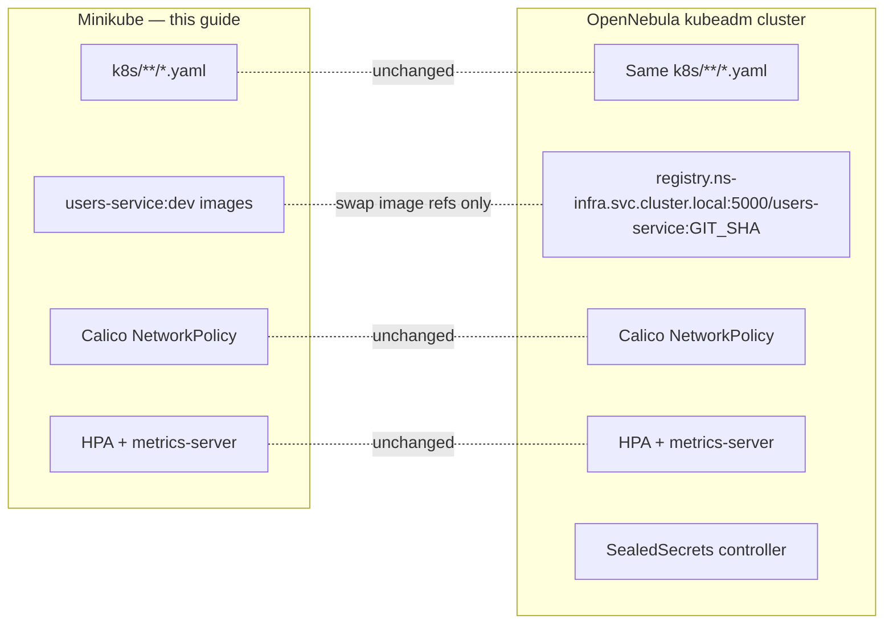

# Running the AircraftSaaS Microservices Architecture Locally with Minikube

This document is a complete, sequential playbook for standing up the proposed Kubernetes architecture (namespaces, NetworkPolicies, HPA, NGINX Ingress, in-cluster Postgres + RabbitMQ) on a single macOS laptop using **Minikube**. Every YAML written here is the same YAML that will later be `kubectl apply`-ed on the OpenNebula cluster — only the image-registry hostname and the secret-encryption mechanism change in production.

The application code itself (the three WebHosts, the proxies in [`Services/Booking.WebHost/Proxies/FleetServiceHttpClient.cs`](AircraftSaaS/Services/Booking.WebHost/Proxies/FleetServiceHttpClient.cs:1), [`Program.cs`](AircraftSaaS/Services/Users.WebHost/Program.cs:1) configuration binding, etc.) is **unchanged**.

---

## Overview



---

## 1. Install prerequisites (macOS)

```bash
brew install minikube kubectl helm k6 stern
brew install --cask docker          # if not already installed
# Optional but useful:
brew install k9s kubectx kustomize
```

Verify:

```bash
minikube version          # >= 1.33
kubectl version --client
docker version            # must show a running engine
```

---

## 2. Start the cluster

A multi-node cluster with **Calico** (so NetworkPolicy is actually enforced — Minikube's default CNI does NOT enforce policies, which is exactly the trap warned about in §3.1 of the architecture proposal):

```bash
minikube start \
  --profile aircraft \
  --nodes 3 \
  --cpus 4 \
  --memory 8192 \
  --disk-size 40g \
  --driver docker \
  --kubernetes-version v1.30.0 \
  --cni calico
```

Switch context explicitly:

```bash
kubectl config use-context aircraft
kubectl get nodes -o wide
```

You should see `aircraft`, `aircraft-m02`, `aircraft-m03`.

Enable the addons you need:

```bash
minikube -p aircraft addons enable ingress           # NGINX ingress controller
minikube -p aircraft addons enable metrics-server    # required for HPA
minikube -p aircraft addons enable registry          # local image registry (optional)
```

Confirm:

```bash
kubectl get pods -A
kubectl top nodes        # may take ~30s after metrics-server starts
```

Label the ingress controller's namespace so the NetworkPolicy `namespaceSelector` in §10 matches:

```bash
kubectl label namespace ingress-nginx name=ns-gateway --overwrite
```

> We treat `ingress-nginx` as the "gateway" namespace rather than creating a separate `ns-gateway`, because Minikube installs the controller into that fixed namespace.

---

## 3. Open the LoadBalancer to your host

In **a separate terminal** (this command must stay running for the whole session):

```bash
minikube -p aircraft tunnel
```

This binds `localhost:80` and `localhost:443` to the cluster's LoadBalancer services and may prompt for `sudo` once.

Test that the controller is reachable:

```bash
curl -I http://localhost           # expect: HTTP/1.1 404 Not Found from nginx
```

The 404 is correct — no Ingress objects exist yet.

---

## 4. Create the repository layout

From the repo root:

```bash
mkdir -p k8s/{base,infra,users,fleet,booking,gateway,network-policies}
```

### 4.1 `k8s/base/namespaces.yaml`

```yaml
apiVersion: v1
kind: Namespace
metadata: { name: ns-users,   labels: { name: ns-users } }
---
apiVersion: v1
kind: Namespace
metadata: { name: ns-fleet,   labels: { name: ns-fleet } }
---
apiVersion: v1
kind: Namespace
metadata: { name: ns-booking, labels: { name: ns-booking } }
---
apiVersion: v1
kind: Namespace
metadata: { name: ns-infra,   labels: { name: ns-infra } }
```

```bash
kubectl apply -f k8s/base/namespaces.yaml
```

### 4.2 Infrastructure — Postgres + RabbitMQ in `ns-infra`

Mirrors the Postgres block in [`AircraftSaaS/docker-compose.yml`](AircraftSaaS/docker-compose.yml:5), including the three logical databases from [`AircraftSaaS/init-databases.sql`](AircraftSaaS/init-databases.sql:1).

**`k8s/infra/postgres.yaml`:**

```yaml
apiVersion: v1
kind: ConfigMap
metadata: { name: pg-init, namespace: ns-infra }
data:
  init.sql: |
    CREATE DATABASE "aircraft-users";
    CREATE DATABASE "aircraft-fleet";
    CREATE DATABASE "aircraft-booking";
---
apiVersion: v1
kind: Service
metadata: { name: postgres, namespace: ns-infra }
spec:
  selector: { app: postgres }
  ports: [{ port: 5432, targetPort: 5432 }]
---
apiVersion: apps/v1
kind: StatefulSet
metadata: { name: postgres, namespace: ns-infra }
spec:
  serviceName: postgres
  replicas: 1
  selector: { matchLabels: { app: postgres } }
  template:
    metadata: { labels: { app: postgres } }
    spec:
      containers:
      - name: postgres
        image: postgres:16
        env:
        - { name: POSTGRES_USER,     value: postgres }
        - { name: POSTGRES_PASSWORD, value: postgres }
        ports: [{ containerPort: 5432 }]
        readinessProbe:
          exec: { command: [pg_isready, -U, postgres] }
          periodSeconds: 5
        volumeMounts:
        - { name: data, mountPath: /var/lib/postgresql/data }
        - { name: init, mountPath: /docker-entrypoint-initdb.d }
      volumes:
      - name: init
        configMap: { name: pg-init }
  volumeClaimTemplates:
  - metadata: { name: data }
    spec:
      accessModes: [ReadWriteOnce]
      resources: { requests: { storage: 1Gi } }
```

**`k8s/infra/rabbitmq.yaml`:**

```yaml
apiVersion: v1
kind: Service
metadata: { name: rabbitmq, namespace: ns-infra }
spec:
  selector: { app: rabbitmq }
  ports:
  - { name: amqp, port: 5672,  targetPort: 5672 }
  - { name: mgmt, port: 15672, targetPort: 15672 }
---
apiVersion: apps/v1
kind: Deployment
metadata: { name: rabbitmq, namespace: ns-infra }
spec:
  replicas: 1
  selector: { matchLabels: { app: rabbitmq } }
  template:
    metadata: { labels: { app: rabbitmq } }
    spec:
      containers:
      - name: rabbitmq
        image: rabbitmq:3-management
        env:
        - { name: RABBITMQ_DEFAULT_USER, value: guest }
        - { name: RABBITMQ_DEFAULT_PASS, value: guest }
        ports:
        - { containerPort: 5672 }
        - { containerPort: 15672 }
        readinessProbe:
          tcpSocket: { port: 5672 }
          initialDelaySeconds: 15
```

Apply and wait:

```bash
kubectl apply -f k8s/infra/
kubectl -n ns-infra rollout status statefulset/postgres --timeout=180s
kubectl -n ns-infra rollout status deployment/rabbitmq  --timeout=180s
```

---

## 5. Build the service images inside Minikube's Docker daemon

The Minikube idiom: build directly into the cluster's Docker engine, so no registry roundtrip is needed.

### Method A — `docker-env` (fastest, recommended)

```bash
eval $(minikube -p aircraft docker-env)

cd AircraftSaaS

docker build -f Services/Users.WebHost/Dockerfile   -t users-service:dev   .
docker build -f Services/Fleet.WebHost/Dockerfile   -t fleet-service:dev   .
docker build -f Services/Booking.WebHost/Dockerfile -t booking-service:dev .

# Verify they exist *inside* Minikube
docker images | grep -E 'users-service|fleet-service|booking-service'

# Switch your shell back to host Docker:
eval $(minikube -p aircraft docker-env --unset)
```

### Method B — build on host, then load

```bash
cd AircraftSaaS
docker build -f Services/Users.WebHost/Dockerfile   -t users-service:dev   .
docker build -f Services/Fleet.WebHost/Dockerfile   -t fleet-service:dev   .
docker build -f Services/Booking.WebHost/Dockerfile -t booking-service:dev .

minikube -p aircraft image load users-service:dev
minikube -p aircraft image load fleet-service:dev
minikube -p aircraft image load booking-service:dev
```

Either way, the manifests below reference the images by short tag with `imagePullPolicy: IfNotPresent` so Kubernetes does NOT try to pull from a real registry.

---

## 6. Per-service manifests

Each service has its own ConfigMap, Secret, Deployment, Service, HPA, and a one-shot **Migration Job** that runs EF Core migrations once per rollout — see §6.4 for why this is required.

The Users manifests come first as the canonical example; **Fleet** (§6.2) and **Booking** (§6.3) are listed explicitly because their cross-service URL keys differ and so does the connection-string key name read by each [`Program.cs`](AircraftSaaS/Services/Fleet.WebHost/Program.cs:1) (`ConnectionStrings__FleetConnection`, `ConnectionStrings__BookingConnection`). The Users-only `SeedIdentity` / `SeedAppUserCompanies` keys (see [`AircraftSaaS/docker-compose.yml:57`](AircraftSaaS/docker-compose.yml:57)) are also dropped from Fleet/Booking.

### 6.1 Users

**`k8s/users/configmap.yaml`:**

```yaml
apiVersion: v1
kind: ConfigMap
metadata: { name: users-config, namespace: ns-users }
data:
  ASPNETCORE_ENVIRONMENT:                       "Production"
  FleetService__BaseUrl:                        "http://fleet-service.ns-fleet.svc.cluster.local:8080"
  BookingService__BaseUrl:                      "http://booking-service.ns-booking.svc.cluster.local:8080"
  RabbitMQ__Host:                               "rabbitmq.ns-infra.svc.cluster.local"
  RabbitMQ__Port:                               "5672"
  JWT__Issuer:                                  "itcollege.taltech.ee"
  JWT__Audience:                                "itcollege.taltech.ee"
  DataInitialization__MigrateDatabase:          "true"
  DataInitialization__SeedIdentity:             "true"
  DataInitialization__SeedData:                 "true"
  DataInitialization__SeedAppUserCompanies:     "true"
```

**`k8s/users/secret.yaml`** (plaintext OK for local; SealedSecrets/SOPS in prod):

```yaml
apiVersion: v1
kind: Secret
metadata: { name: users-secret, namespace: ns-users }
type: Opaque
stringData:
  ConnectionStrings__UsersConnection: "Host=postgres.ns-infra.svc.cluster.local;Port=5432;Database=aircraft-users;Username=postgres;Password=postgres"
  JWT__Key:           "some_secret_password_dont_share.at.iausdhviushviusdhuisdhgiusdfhliuhdiufvhidufvhidufhviudsfh"
  RabbitMQ__UserName: "guest"
  RabbitMQ__Password: "guest"
```

**`k8s/users/deployment.yaml`:**

```yaml
apiVersion: apps/v1
kind: Deployment
metadata: { name: users-service, namespace: ns-users }
spec:
  replicas: 2
  selector: { matchLabels: { app: users-service } }
  template:
    metadata: { labels: { app: users-service } }
    spec:
      containers:
      - name: users-service
        image: users-service:dev
        imagePullPolicy: IfNotPresent       # critical: local image, no registry pull
        ports: [{ containerPort: 8080 }]
        envFrom:
        - configMapRef: { name: users-config }
        - secretRef:    { name: users-secret }
        readinessProbe:
          httpGet: { path: /health, port: 8080 }
          initialDelaySeconds: 10
          periodSeconds: 5
        livenessProbe:
          httpGet: { path: /health, port: 8080 }
          initialDelaySeconds: 45
          periodSeconds: 15
        resources:
          requests: { cpu: 100m, memory: 256Mi }
          limits:   { cpu: 500m, memory: 512Mi }
        securityContext:
          runAsNonRoot: true
          allowPrivilegeEscalation: false
          capabilities: { drop: ["ALL"] }
```

**`k8s/users/service.yaml`:**

```yaml
apiVersion: v1
kind: Service
metadata: { name: users-service, namespace: ns-users }
spec:
  selector: { app: users-service }
  ports: [{ port: 8080, targetPort: 8080 }]
```

**`k8s/users/hpa.yaml`:**

```yaml
apiVersion: autoscaling/v2
kind: HorizontalPodAutoscaler
metadata: { name: users-hpa, namespace: ns-users }
spec:
  scaleTargetRef: { apiVersion: apps/v1, kind: Deployment, name: users-service }
  minReplicas: 2
  maxReplicas: 10
  metrics:
  - type: Resource
    resource: { name: cpu, target: { type: Utilization, averageUtilization: 70 } }
```

### 6.2 Fleet

**`k8s/fleet/configmap.yaml`:**

```yaml
apiVersion: v1
kind: ConfigMap
metadata: { name: fleet-config, namespace: ns-fleet }
data:
  ASPNETCORE_ENVIRONMENT:                       "Production"
  UsersService__BaseUrl:                        "http://users-service.ns-users.svc.cluster.local:8080"
  BookingService__BaseUrl:                      "http://booking-service.ns-booking.svc.cluster.local:8080"
  RabbitMQ__Host:                               "rabbitmq.ns-infra.svc.cluster.local"
  RabbitMQ__Port:                               "5672"
  JWT__Issuer:                                  "itcollege.taltech.ee"
  JWT__Audience:                                "itcollege.taltech.ee"
  DataInitialization__MigrateDatabase:          "true"
  DataInitialization__SeedData:                 "true"
```

**`k8s/fleet/secret.yaml`** (plaintext OK for local):

```yaml
apiVersion: v1
kind: Secret
metadata: { name: fleet-secret, namespace: ns-fleet }
type: Opaque
stringData:
  ConnectionStrings__FleetConnection: "Host=postgres.ns-infra.svc.cluster.local;Port=5432;Database=aircraft-fleet;Username=postgres;Password=postgres"
  JWT__Key:           "some_secret_password_dont_share.at.iausdhviushviusdhuisdhgiusdfhliuhdiufvhidufvhidufhviudsfh"
  RabbitMQ__UserName: "guest"
  RabbitMQ__Password: "guest"
```

**`k8s/fleet/deployment.yaml`:**

```yaml
apiVersion: apps/v1
kind: Deployment
metadata: { name: fleet-service, namespace: ns-fleet }
spec:
  replicas: 2
  selector: { matchLabels: { app: fleet-service } }
  template:
    metadata: { labels: { app: fleet-service } }
    spec:
      containers:
      - name: fleet-service
        image: fleet-service:dev
        imagePullPolicy: IfNotPresent
        ports: [{ containerPort: 8080 }]
        envFrom:
        - configMapRef: { name: fleet-config }
        - secretRef:    { name: fleet-secret }
        readinessProbe:
          httpGet: { path: /health, port: 8080 }
          initialDelaySeconds: 10
          periodSeconds: 5
        livenessProbe:
          httpGet: { path: /health, port: 8080 }
          initialDelaySeconds: 45
          periodSeconds: 15
        resources:
          requests: { cpu: 100m, memory: 256Mi }
          limits:   { cpu: 500m, memory: 512Mi }
        securityContext:
          runAsNonRoot: true
          allowPrivilegeEscalation: false
          capabilities: { drop: ["ALL"] }
```

> **Important:** because both Fleet replicas would otherwise race each other running EF `Migrate()` on first rollout, set `DataInitialization__MigrateDatabase=false` in the ConfigMap above **once §6.4 (Migration Job) is in place**, and let the Job own schema changes exclusively.

**`k8s/fleet/service.yaml`:**

```yaml
apiVersion: v1
kind: Service
metadata: { name: fleet-service, namespace: ns-fleet }
spec:
  selector: { app: fleet-service }
  ports: [{ port: 8080, targetPort: 8080 }]
```

**`k8s/fleet/hpa.yaml`:**

```yaml
apiVersion: autoscaling/v2
kind: HorizontalPodAutoscaler
metadata: { name: fleet-hpa, namespace: ns-fleet }
spec:
  scaleTargetRef: { apiVersion: apps/v1, kind: Deployment, name: fleet-service }
  minReplicas: 2
  maxReplicas: 10
  metrics:
  - type: Resource
    resource: { name: cpu, target: { type: Utilization, averageUtilization: 70 } }
```

### 6.3 Booking

**`k8s/booking/configmap.yaml`:**

```yaml
apiVersion: v1
kind: ConfigMap
metadata: { name: booking-config, namespace: ns-booking }
data:
  ASPNETCORE_ENVIRONMENT:                       "Production"
  FleetService__BaseUrl:                        "http://fleet-service.ns-fleet.svc.cluster.local:8080"
  UsersService__BaseUrl:                        "http://users-service.ns-users.svc.cluster.local:8080"
  RabbitMQ__Host:                               "rabbitmq.ns-infra.svc.cluster.local"
  RabbitMQ__Port:                               "5672"
  JWT__Issuer:                                  "itcollege.taltech.ee"
  JWT__Audience:                                "itcollege.taltech.ee"
  DataInitialization__MigrateDatabase:          "true"
  DataInitialization__SeedData:                 "true"
```

**`k8s/booking/secret.yaml`:**

```yaml
apiVersion: v1
kind: Secret
metadata: { name: booking-secret, namespace: ns-booking }
type: Opaque
stringData:
  ConnectionStrings__BookingConnection: "Host=postgres.ns-infra.svc.cluster.local;Port=5432;Database=aircraft-booking;Username=postgres;Password=postgres"
  JWT__Key:           "some_secret_password_dont_share.at.iausdhviushviusdhuisdhgiusdfhliuhdiufvhidufvhidufhviudsfh"
  RabbitMQ__UserName: "guest"
  RabbitMQ__Password: "guest"
```

**`k8s/booking/deployment.yaml`:**

```yaml
apiVersion: apps/v1
kind: Deployment
metadata: { name: booking-service, namespace: ns-booking }
spec:
  replicas: 2
  selector: { matchLabels: { app: booking-service } }
  template:
    metadata: { labels: { app: booking-service } }
    spec:
      containers:
      - name: booking-service
        image: booking-service:dev
        imagePullPolicy: IfNotPresent
        ports: [{ containerPort: 8080 }]
        envFrom:
        - configMapRef: { name: booking-config }
        - secretRef:    { name: booking-secret }
        readinessProbe:
          httpGet: { path: /health, port: 8080 }
          initialDelaySeconds: 10
          periodSeconds: 5
        livenessProbe:
          httpGet: { path: /health, port: 8080 }
          initialDelaySeconds: 45
          periodSeconds: 15
        resources:
          requests: { cpu: 100m, memory: 256Mi }
          limits:   { cpu: 500m, memory: 512Mi }
        securityContext:
          runAsNonRoot: true
          allowPrivilegeEscalation: false
          capabilities: { drop: ["ALL"] }
```

**`k8s/booking/service.yaml`:**

```yaml
apiVersion: v1
kind: Service
metadata: { name: booking-service, namespace: ns-booking }
spec:
  selector: { app: booking-service }
  ports: [{ port: 8080, targetPort: 8080 }]
```

**`k8s/booking/hpa.yaml`:**

```yaml
apiVersion: autoscaling/v2
kind: HorizontalPodAutoscaler
metadata: { name: booking-hpa, namespace: ns-booking }
spec:
  scaleTargetRef: { apiVersion: apps/v1, kind: Deployment, name: booking-service }
  minReplicas: 2
  maxReplicas: 10
  metrics:
  - type: Resource
    resource: { name: cpu, target: { type: Utilization, averageUtilization: 70 } }
```

### 6.4 One-shot Migration Jobs (per service)

With `replicas: 2`, the previous troubleshooting note (§8) warned about EF `Migrate()` racing between pods. The clean fix is a `Job` that runs once per rollout, blocks via `initContainers`/`kubectl wait`, and is the **only** code path allowed to mutate schema. The application pods then start with `DataInitialization__MigrateDatabase=false` and skip `Migrate()` entirely.

> Implementation contract: each WebHost's `Program.cs` already reads `DataInitialization:MigrateDatabase` — when `false`, the startup hosted service must short-circuit and NOT call `dbContext.Database.Migrate()`. If yours doesn't yet, that is a one-line change (`if (cfg.GetValue<bool>("DataInitialization:MigrateDatabase")) await db.Database.MigrateAsync();`) — no behavioural impact on docker-compose, where the env var stays `true`.

**`k8s/users/migration-job.yaml`** (template — replicate for fleet/booking):

```yaml
apiVersion: batch/v1
kind: Job
metadata:
  name: users-migrate
  namespace: ns-users
  annotations:
    # Force a new Job on every `kubectl apply` by templating GIT_SHA into the name
    # in CI; locally you can `kubectl delete job users-migrate` before re-applying.
    description: "Runs EF Core Migrate() exactly once before users-service rollout."
spec:
  backoffLimit: 2
  ttlSecondsAfterFinished: 600
  template:
    spec:
      restartPolicy: OnFailure
      containers:
      - name: migrate
        image: users-service:dev
        imagePullPolicy: IfNotPresent
        # The same binary, but with MigrateDatabase=true and a no-op web flag so it
        # exits after Migrate() completes. Implement an --migrate-only switch in
        # Program.cs OR use a minimal startup that calls db.Database.Migrate() and
        # returns 0. Easiest: a dedicated console entrypoint (Users.Migrator) added
        # to the same image; until that exists, set the env var and let the app
        # call Migrate() at boot, then kill itself via a liveness probe at /shutdown.
        env:
        - { name: ASPNETCORE_ENVIRONMENT,                   value: "Production" }
        - { name: DataInitialization__MigrateDatabase,      value: "true" }
        - { name: DataInitialization__SeedIdentity,         value: "true" }
        - { name: DataInitialization__SeedData,             value: "true" }
        - { name: DataInitialization__SeedAppUserCompanies, value: "true" }
        - { name: DataInitialization__ExitAfterMigrate,     value: "true" }
        envFrom:
        - secretRef: { name: users-secret }
```

Run order:

```bash
# 1. Apply config + secret first
kubectl apply -f k8s/users/configmap.yaml -f k8s/users/secret.yaml

# 2. Run the migration to completion
kubectl apply -f k8s/users/migration-job.yaml
kubectl -n ns-users wait --for=condition=complete job/users-migrate --timeout=180s

# 3. Now apply the Deployment (which has MigrateDatabase=false in its ConfigMap)
kubectl apply -f k8s/users/deployment.yaml -f k8s/users/service.yaml -f k8s/users/hpa.yaml
```

> Local convenience: until you've added the `ExitAfterMigrate` switch in [`Program.cs`](AircraftSaaS/Services/Users.WebHost/Program.cs:1), keep `replicas: 1` for the first apply (so only one pod runs `Migrate()`), then `kubectl scale --replicas=2` once the schema is in place. Both approaches converge to the same end state.

After §6.4 is wired in, update each ConfigMap so `DataInitialization__MigrateDatabase: "false"` for the long-running Deployment — Migration is the Job's job.

---

## 7. Ingress

The ingress controller installed by `minikube addons enable ingress` lives in the `ingress-nginx` namespace, but Ingress objects can live in any namespace. Simplest approach: one Ingress per service in its own namespace.

**`k8s/gateway/ingress.yaml`:**

```yaml
apiVersion: networking.k8s.io/v1
kind: Ingress
metadata:
  name: users-ingress
  namespace: ns-users
  annotations:
    nginx.ingress.kubernetes.io/rewrite-target: /$2
spec:
  ingressClassName: nginx
  rules:
  - host: aircraft.localtest.me
    http:
      paths:
      - path: /api/users(/|$)(.*)
        pathType: ImplementationSpecific
        backend: { service: { name: users-service, port: { number: 8080 } } }
---
apiVersion: networking.k8s.io/v1
kind: Ingress
metadata:
  name: fleet-ingress
  namespace: ns-fleet
  annotations: { nginx.ingress.kubernetes.io/rewrite-target: /$2 }
spec:
  ingressClassName: nginx
  rules:
  - host: aircraft.localtest.me
    http:
      paths:
      - path: /api/fleet(/|$)(.*)
        pathType: ImplementationSpecific
        backend: { service: { name: fleet-service, port: { number: 8080 } } }
---
apiVersion: networking.k8s.io/v1
kind: Ingress
metadata:
  name: booking-ingress
  namespace: ns-booking
  annotations: { nginx.ingress.kubernetes.io/rewrite-target: /$2 }
spec:
  ingressClassName: nginx
  rules:
  - host: aircraft.localtest.me
    http:
      paths:
      - path: /api/booking(/|$)(.*)
        pathType: ImplementationSpecific
        backend: { service: { name: booking-service, port: { number: 8080 } } }
```

> `aircraft.localtest.me` is a public DNS name that always resolves to `127.0.0.1` — no `/etc/hosts` editing required.

---

## 8. Deploy

The recommended order is **migrate first, then deploy** — exactly as a CI pipeline would do it (see §6.4):

```bash
# 1) Apply ConfigMaps + Secrets per service (no Deployments yet)
kubectl apply -f k8s/users/configmap.yaml -f k8s/users/secret.yaml
kubectl apply -f k8s/fleet/configmap.yaml -f k8s/fleet/secret.yaml
kubectl apply -f k8s/booking/configmap.yaml -f k8s/booking/secret.yaml

# 2) Run schema migrations to completion (idempotent)
kubectl apply -f k8s/users/migration-job.yaml
kubectl apply -f k8s/fleet/migration-job.yaml
kubectl apply -f k8s/booking/migration-job.yaml
kubectl -n ns-users   wait --for=condition=complete job/users-migrate   --timeout=180s
kubectl -n ns-fleet   wait --for=condition=complete job/fleet-migrate   --timeout=180s
kubectl -n ns-booking wait --for=condition=complete job/booking-migrate --timeout=180s

# 3) Now the long-running Deployments + Services + HPAs + Ingress
kubectl apply -f k8s/users/deployment.yaml   -f k8s/users/service.yaml   -f k8s/users/hpa.yaml
kubectl apply -f k8s/fleet/deployment.yaml   -f k8s/fleet/service.yaml   -f k8s/fleet/hpa.yaml
kubectl apply -f k8s/booking/deployment.yaml -f k8s/booking/service.yaml -f k8s/booking/hpa.yaml
kubectl apply -f k8s/gateway/

# Watch them come up:
kubectl get pods -A -w
# Or focused tail:
stern -n ns-users users-service
```

> If you haven't yet implemented the `ExitAfterMigrate` switch referenced in §6.4, skip step 2 and instead apply the Deployments with `replicas: 1` first, then `kubectl scale --replicas=2` once each pod has logged "migration complete". The end state is identical.

Expected after ~60 s:

```
ns-users      users-service-xxxx-1   1/1   Running
ns-users      users-service-xxxx-2   1/1   Running
ns-fleet      fleet-service-xxxx-1   1/1   Running
ns-fleet      fleet-service-xxxx-2   1/1   Running
ns-booking    booking-service-xxxx-1 1/1   Running
ns-booking    booking-service-xxxx-2 1/1   Running
```

### Troubleshooting

| Symptom | Cause | Fix |
|---|---|---|
| `ErrImageNeverPull` or `ImagePullBackOff` | Image not in Minikube's daemon | Re-run `eval $(minikube docker-env)` + `docker build`, or `minikube image load users-service:dev` |
| `CrashLoopBackOff`, logs say "connection refused to postgres" | Postgres still initializing on first start | Wait 30–60 s; Postgres seeds three DBs from `init.sql` only on first run |
| Readiness probe 404 | `/health` not mapped in that WebHost | Check that [`Services/Users.WebHost/Program.cs`](AircraftSaaS/Services/Users.WebHost/Program.cs:1) calls `app.MapHealthChecks("/health")` |
| Migrations race when replicas=2 | Two pods running EF `Migrate()` simultaneously | Use the one-shot Migration Job pattern in §6.4 (preferred) — or as a temporary workaround set `replicas: 1` for the first rollout and `kubectl scale --replicas=2` once Postgres has the schema |

---

## 9. Smoke-test the running system

`minikube tunnel` must still be running in another terminal.

```bash
# Health
curl http://aircraft.localtest.me/api/users/health
curl http://aircraft.localtest.me/api/fleet/health
curl http://aircraft.localtest.me/api/booking/health

# Login (use whatever your seeder creates)
curl -i -X POST http://aircraft.localtest.me/api/users/identity/Account/Login \
     -H "Content-Type: application/json" \
     -d '{"email":"admin@itcollege.ee","password":"Foo.Bar.1"}'

# Fleet list
curl http://aircraft.localtest.me/api/fleet/Aircraft

# Cross-service check (Booking pod calling Users via cluster DNS)
kubectl -n ns-booking exec deploy/booking-service -- \
  wget -qO- http://users-service.ns-users.svc.cluster.local:8080/health
```

---

## 10. NetworkPolicies & validation matrix

Calico (enabled in §2) enforces these properly.

**`k8s/network-policies/default-deny.yaml`** — applied to **all four** namespaces, including `ns-infra` (otherwise Postgres and RabbitMQ remain reachable cluster-wide):

```yaml
apiVersion: networking.k8s.io/v1
kind: NetworkPolicy
metadata: { name: default-deny, namespace: ns-users }
spec: { podSelector: {}, policyTypes: [Ingress, Egress] }
---
apiVersion: networking.k8s.io/v1
kind: NetworkPolicy
metadata: { name: default-deny, namespace: ns-fleet }
spec: { podSelector: {}, policyTypes: [Ingress, Egress] }
---
apiVersion: networking.k8s.io/v1
kind: NetworkPolicy
metadata: { name: default-deny, namespace: ns-booking }
spec: { podSelector: {}, policyTypes: [Ingress, Egress] }
---
apiVersion: networking.k8s.io/v1
kind: NetworkPolicy
metadata: { name: default-deny, namespace: ns-infra }
spec: { podSelector: {}, policyTypes: [Ingress, Egress] }
```

> **Why `ns-infra` needs a default-deny too:** without it, any future pod in `default` (or a forgotten debug namespace) can `psql` straight into the cluster's Postgres. Default-deny + an explicit `allow-from-apps` policy is the only configuration that satisfies the "namespace-level enforcement" outcome in §5 of the architecture proposal.

**Label `kube-system` and `ns-infra`** so DNS egress and infra-allow rules can target them precisely (rather than the over-broad `namespaceSelector: {}` which matches every namespace, including `default`):

```bash
kubectl label namespace kube-system name=kube-system --overwrite
kubectl label namespace ns-infra    name=ns-infra    --overwrite
```

**`k8s/network-policies/allow-booking.yaml`:**

```yaml
apiVersion: networking.k8s.io/v1
kind: NetworkPolicy
metadata: { name: allow-booking-ingress, namespace: ns-booking }
spec:
  podSelector: { matchLabels: { app: booking-service } }
  policyTypes: [Ingress]
  ingress:
  - from:
    - namespaceSelector: { matchLabels: { name: ns-gateway } }
    - namespaceSelector: { matchLabels: { name: ns-users } }
    - namespaceSelector: { matchLabels: { name: ns-fleet } }
    ports: [{ protocol: TCP, port: 8080 }]
---
apiVersion: networking.k8s.io/v1
kind: NetworkPolicy
metadata: { name: allow-booking-egress, namespace: ns-booking }
spec:
  podSelector: { matchLabels: { app: booking-service } }
  policyTypes: [Egress]
  egress:
  # DNS — restricted to kube-system (CoreDNS) only
  - to:
    - namespaceSelector: { matchLabels: { name: kube-system } }
    ports:
    - { protocol: UDP, port: 53 }
    - { protocol: TCP, port: 53 }
  # fleet
  - to:
    - namespaceSelector: { matchLabels: { name: ns-fleet } }
      podSelector:       { matchLabels: { app: fleet-service } }
    ports: [{ protocol: TCP, port: 8080 }]
  # users
  - to:
    - namespaceSelector: { matchLabels: { name: ns-users } }
      podSelector:       { matchLabels: { app: users-service } }
    ports: [{ protocol: TCP, port: 8080 }]
  # postgres + rabbitmq
  - to:
    - namespaceSelector: { matchLabels: { name: ns-infra } }
    ports:
    - { protocol: TCP, port: 5432 }
    - { protocol: TCP, port: 5672 }
```

**`k8s/network-policies/allow-users.yaml`:**

```yaml
apiVersion: networking.k8s.io/v1
kind: NetworkPolicy
metadata: { name: allow-users-ingress, namespace: ns-users }
spec:
  podSelector: { matchLabels: { app: users-service } }
  policyTypes: [Ingress]
  ingress:
  - from:
    - namespaceSelector: { matchLabels: { name: ns-gateway } }
    - namespaceSelector: { matchLabels: { name: ns-fleet } }
    - namespaceSelector: { matchLabels: { name: ns-booking } }
    ports: [{ protocol: TCP, port: 8080 }]
---
apiVersion: networking.k8s.io/v1
kind: NetworkPolicy
metadata: { name: allow-users-egress, namespace: ns-users }
spec:
  podSelector: { matchLabels: { app: users-service } }
  policyTypes: [Egress]
  egress:
  - to:
    - namespaceSelector: { matchLabels: { name: kube-system } }
    ports:
    - { protocol: UDP, port: 53 }
    - { protocol: TCP, port: 53 }
  - to:
    - namespaceSelector: { matchLabels: { name: ns-fleet } }
      podSelector:       { matchLabels: { app: fleet-service } }
    ports: [{ protocol: TCP, port: 8080 }]
  - to:
    - namespaceSelector: { matchLabels: { name: ns-booking } }
      podSelector:       { matchLabels: { app: booking-service } }
    ports: [{ protocol: TCP, port: 8080 }]
  - to:
    - namespaceSelector: { matchLabels: { name: ns-infra } }
    ports:
    - { protocol: TCP, port: 5432 }
    - { protocol: TCP, port: 5672 }
```

**`k8s/network-policies/allow-fleet.yaml`:**

```yaml
apiVersion: networking.k8s.io/v1
kind: NetworkPolicy
metadata: { name: allow-fleet-ingress, namespace: ns-fleet }
spec:
  podSelector: { matchLabels: { app: fleet-service } }
  policyTypes: [Ingress]
  ingress:
  - from:
    - namespaceSelector: { matchLabels: { name: ns-gateway } }
    - namespaceSelector: { matchLabels: { name: ns-users } }
    - namespaceSelector: { matchLabels: { name: ns-booking } }
    ports: [{ protocol: TCP, port: 8080 }]
---
apiVersion: networking.k8s.io/v1
kind: NetworkPolicy
metadata: { name: allow-fleet-egress, namespace: ns-fleet }
spec:
  podSelector: { matchLabels: { app: fleet-service } }
  policyTypes: [Egress]
  egress:
  - to:
    - namespaceSelector: { matchLabels: { name: kube-system } }
    ports:
    - { protocol: UDP, port: 53 }
    - { protocol: TCP, port: 53 }
  - to:
    - namespaceSelector: { matchLabels: { name: ns-users } }
      podSelector:       { matchLabels: { app: users-service } }
    ports: [{ protocol: TCP, port: 8080 }]
  - to:
    - namespaceSelector: { matchLabels: { name: ns-booking } }
      podSelector:       { matchLabels: { app: booking-service } }
    ports: [{ protocol: TCP, port: 8080 }]
  - to:
    - namespaceSelector: { matchLabels: { name: ns-infra } }
    ports:
    - { protocol: TCP, port: 5432 }
    - { protocol: TCP, port: 5672 }
```

**`k8s/network-policies/allow-infra.yaml`** — lets Postgres and RabbitMQ accept connections **only** from the three app namespaces (after the `ns-infra` default-deny):

```yaml
apiVersion: networking.k8s.io/v1
kind: NetworkPolicy
metadata: { name: allow-postgres-ingress, namespace: ns-infra }
spec:
  podSelector: { matchLabels: { app: postgres } }
  policyTypes: [Ingress]
  ingress:
  - from:
    - namespaceSelector: { matchLabels: { name: ns-users } }
    - namespaceSelector: { matchLabels: { name: ns-fleet } }
    - namespaceSelector: { matchLabels: { name: ns-booking } }
    ports: [{ protocol: TCP, port: 5432 }]
---
apiVersion: networking.k8s.io/v1
kind: NetworkPolicy
metadata: { name: allow-rabbitmq-ingress, namespace: ns-infra }
spec:
  podSelector: { matchLabels: { app: rabbitmq } }
  policyTypes: [Ingress]
  ingress:
  - from:
    - namespaceSelector: { matchLabels: { name: ns-users } }
    - namespaceSelector: { matchLabels: { name: ns-fleet } }
    - namespaceSelector: { matchLabels: { name: ns-booking } }
    ports:
    - { protocol: TCP, port: 5672 }
    - { protocol: TCP, port: 15672 }
---
# Both Postgres and RabbitMQ still need DNS egress (peer/cluster name resolution).
apiVersion: networking.k8s.io/v1
kind: NetworkPolicy
metadata: { name: allow-infra-dns-egress, namespace: ns-infra }
spec:
  podSelector: {}
  policyTypes: [Egress]
  egress:
  - to:
    - namespaceSelector: { matchLabels: { name: kube-system } }
    ports:
    - { protocol: UDP, port: 53 }
    - { protocol: TCP, port: 53 }
```

Apply the bundle:

```bash
kubectl apply -f k8s/network-policies/
```

### Validation matrix

Aligned with the proxy call graph in §4.2 of the architecture proposal — every WebHost has both an `ICompanyService`-style users proxy and a fleet proxy (see [`Services/Fleet.WebHost/Proxies/UsersServiceHttpClient.cs`](AircraftSaaS/Services/Fleet.WebHost/Proxies/UsersServiceHttpClient.cs:1), [`Services/Booking.WebHost/Proxies/FleetServiceHttpClient.cs`](AircraftSaaS/Services/Booking.WebHost/Proxies/FleetServiceHttpClient.cs:1), [`Services/Users.WebHost/Proxies/BookingServiceHttpClient.cs`](AircraftSaaS/Services/Users.WebHost/Proxies/BookingServiceHttpClient.cs:1)), so the matrix is fully symmetric between the three app namespaces:

| From → To       | users | fleet | booking | postgres | rabbitmq |
|-----------------|-------|-------|---------|----------|----------|
| **ns-gateway**  | ✅    | ✅    | ✅      | ❌       | ❌       |
| **ns-users**    | —     | ✅    | ✅      | ✅       | ✅       |
| **ns-fleet**    | ✅    | —     | ✅      | ✅       | ✅       |
| **ns-booking**  | ✅    | ✅    | —       | ✅       | ✅       |
| **default**     | ❌    | ❌    | ❌      | ❌       | ❌       |
| **kube-system** | ❌    | ❌    | ❌      | ❌       | ❌       |

> If your `Booking → Fleet` cell came back ❌ on the first apply, you likely missed the `ns-fleet` entry in `allow-booking-egress` or the symmetric ingress entry in `allow-fleet-ingress`. Both are present in the YAML above; if you copy only the original Booking-only snippet, the matrix degrades to the asymmetric one previously printed here.

Each test:

```bash
# Allowed (booking → fleet)
kubectl -n ns-booking run probe-$RANDOM --rm -it --restart=Never --image=curlimages/curl -- \
  curl -m 3 -sS -o /dev/null -w "%{http_code}\n" \
  http://fleet-service.ns-fleet.svc.cluster.local:8080/health
# Expect: 200

# Denied (default → users)
kubectl -n default run probe-$RANDOM --rm -it --restart=Never --image=curlimages/curl -- \
  curl -m 3 -sS http://users-service.ns-users.svc.cluster.local:8080/health
# Expect: timeout / connection refused
```

Record this table — it satisfies the "namespace-level NetworkPolicy enforcement with validation" outcome from §5 of the architecture proposal.

---

## 11. Demonstrate HPA scaling

**`scripts/load-fleet.js`:**

```javascript
import http from 'k6/http';
import { sleep } from 'k6';
export const options = {
  stages: [
    { duration: '30s', target: 50 },
    { duration: '2m',  target: 300 },
    { duration: '1m',  target: 0 },
  ],
};
export default function () {
  http.get('http://aircraft.localtest.me/api/fleet/Aircraft');
  sleep(0.1);
}
```

```bash
k6 run scripts/load-fleet.js

# In another terminal:
watch -n 1 'kubectl -n ns-fleet get hpa,deploy,pods'
```

You should see `fleet-service` scale from 2 → 6–10 replicas as CPU exceeds 70 %, then back to 2 after the test ends (default 5-minute stabilization). Screenshot the HPA events and `kubectl top pods` output — that's the scalability evidence for §5 outcome 5.

For nicer graphs, install Prometheus + Grafana:

```bash
helm repo add prometheus-community https://prometheus-community.github.io/helm-charts
helm install kps prometheus-community/kube-prometheus-stack \
  -n ns-monitoring --create-namespace
kubectl -n ns-monitoring port-forward svc/kps-grafana 3000:80
# Open http://localhost:3000 → admin / prom-operator
```

---

## 12. Rapid dev loop

After a code change in any service:

```bash
eval $(minikube -p aircraft docker-env)
cd AircraftSaaS
docker build -f Services/Users.WebHost/Dockerfile -t users-service:dev .
eval $(minikube -p aircraft docker-env --unset)

kubectl -n ns-users rollout restart deploy/users-service
kubectl -n ns-users rollout status   deploy/users-service
```

Convenience aliases (put in `~/.zshrc`):

```bash
alias mk='minikube -p aircraft'
alias mkenv='eval $(minikube -p aircraft docker-env)'
alias mkenv-unset='eval $(minikube -p aircraft docker-env --unset)'
```

---

## 13. Cleanup

```bash
# Stop but keep cluster state:
minikube -p aircraft stop

# Wipe everything:
minikube -p aircraft delete
```

---

## 14. What carries over unchanged to OpenNebula



When moving to OpenNebula:

1. Change every manifest's `image:` from `users-service:dev` → `registry.ns-infra.svc.cluster.local:5000/users-service:<sha>` and set `imagePullPolicy: Always`.
2. Install a SealedSecrets controller; convert each `k8s/*/secret.yaml` into a `SealedSecret`.
3. Point your GitHub Actions self-hosted runner at the OpenNebula API server.

Nothing in the application code — no [`Program.cs`](AircraftSaaS/Services/Users.WebHost/Program.cs:1), no [`FleetServiceHttpClient.cs`](AircraftSaaS/Services/Booking.WebHost/Proxies/FleetServiceHttpClient.cs:1), no [`AircraftSaaS/docker-compose.yml`](AircraftSaaS/docker-compose.yml:1) — needs to change.
