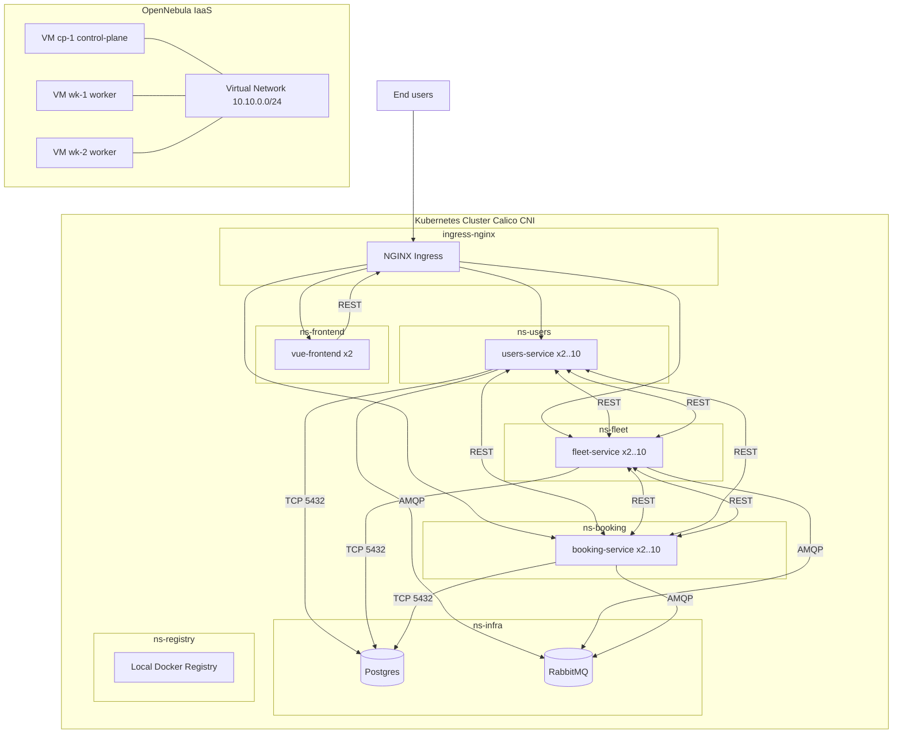
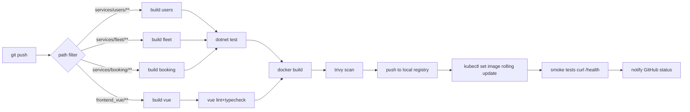

# Deployment Plan — Aircraft Rental Marketplace on Kubernetes

> Migration of the C# AircraftSaaS monolith to a Kubernetes-orchestrated microservices architecture, deployed on an OpenNebula IaaS substrate, with a fully local CI/CD pipeline, namespace-level network isolation, and demonstrable horizontal scaling.

---

## 0. Current State (what already exists in this repo)

Before planning new work, the existing artefacts the plan builds on:

| Area | Asset | Path |
|---|---|---|
| Decomposed backend | Users, Fleet, Booking WebHosts (each with its own `Program.cs`, `Dockerfile`, EF migrations) | [`AircraftSaaS/Services/Users.WebHost/`](AircraftSaaS/Services/Users.WebHost/), [`AircraftSaaS/Services/Fleet.WebHost/`](AircraftSaaS/Services/Fleet.WebHost/), [`AircraftSaaS/Services/Booking.WebHost/`](AircraftSaaS/Services/Booking.WebHost/) |
| Event bus client | RabbitMQ publisher/consumer base | [`AircraftSaaS/Shared/Shared.Messaging/`](AircraftSaaS/Shared/Shared.Messaging/) |
| Inter-service HTTP proxies | e.g. [`FleetServiceHttpClient.cs`](AircraftSaaS/Services/Booking.WebHost/Proxies/FleetServiceHttpClient.cs:1) |
| Local compose stack (parity reference) | [`AircraftSaaS/docker-compose.yml`](AircraftSaaS/docker-compose.yml:1) |
| Vue frontend container | [`frontend_vue/Dockerfile`](frontend_vue/Dockerfile:1), [`frontend_vue/nginx.conf`](frontend_vue/nginx.conf:1) |
| Kubernetes manifests (already scaffolded) | namespaces, per-service Deployment/Service/ConfigMap/Secret/HPA/Migration-Job, Postgres + RabbitMQ infra, Ingress, default-deny + per-service NetworkPolicies | [`k8s/`](k8s/) |

The plan below treats those as the **baseline** and focuses on the gaps required by the project brief: OpenNebula provisioning, a local in-cluster registry, GitHub Actions CI/CD, frontend Kubernetes deployment, hardened images, RBAC, and a scaling/security validation harness.

---

## 1. Target Architecture



Cluster topology: **1 control-plane + 2 workers**, Calico CNI (NetworkPolicy must be enforced — the brief's security guarantees depend on it), and an isolated OpenNebula vNet for cluster traffic.

---

## 2. OpenNebula IaaS Layer

The OpenNebula layer is split into two phases that this plan **explicitly separates**: the **Current Cluster** (already in place — used as the validation target right away) and the **Future OpenNebula Automation Step** (to be authored later as a separate, schedulable work item).

### 2.1 Current Cluster (manually created — used as-is for validation)

A 3-VM Kubernetes cluster has already been provisioned by hand on OpenNebula and is **currently running**. The plan from §3 onwards consumes this cluster as its primary deploy target:

- **3 Ubuntu 22.04 LTS VMs** instantiated manually from the OpenNebula web UI / CLI: `cp-1` (control-plane), `wk-1`, `wk-2` (workers).
- `containerd`, `kubeadm`, `kubelet`, `kubectl` (v1.30.x) installed by hand, swap disabled, `kubeadm init` / `kubeadm join` executed manually, Calico CNI applied manually.
- Networking: nodes share an OpenNebula vNet; an edge IP/DNS name (`aircraft.example.com` or similar) is reachable from outside.
- **Inputs the PaaS layer takes from this cluster**: an admin `kubeconfig`, the edge IP/DNS, and a `kubectl get nodes` that returns three `Ready` nodes.

This manually built cluster is the validation environment for **all of Phases A → C → E** of §8. Nothing in those phases requires the future automation to exist.

### 2.2 OpenNebula Automation Step — **now shipped, see [`plans/opennebula.md`](opennebula.md)**

> **Status update.** When this document was first written, §2.2 described a deferred work item. The §2.1 manual cluster has since been **torn down**, and the deferred work has been authored as a sibling plan: [`plans/opennebula.md`](opennebula.md). That plan now owns:
>
> 1. the contents of the [`opennebula/`](../opennebula/) tree (templates, vNet, cloud-init, security groups, oneflow service, runbook), AND
> 2. the small set of `k8s/*` refactors required to consolidate the manifests around the OpenNebula production overlay as the sole deploy target.
>
> The PaaS overlay [`k8s/overlays/opennebula/kustomization.yaml`](../k8s/overlays/opennebula/kustomization.yaml) is unchanged structurally — `plans/opennebula.md` only adds four targeted patches there (`imagePullPolicy: Always`, migration-Job image rewrites, frontend Ingress CSP rewrite, plaintext registry-secret removal).
>
> The original sketch below is preserved for context. Treat it as informational; the executable spec is in [`plans/opennebula.md`](opennebula.md).
>
> ---

> The work to **automate** the same cluster's creation will be authored as a **separate task** later. Its purpose is reproducibility, not adding new functionality: applying the templates below to a clean OpenNebula tenancy must produce a cluster byte-equivalent to the one §2.1 set up by hand.

Future deliverables to be produced under a sibling `opennebula/` directory (out of scope for this deploy plan):

- `opennebula/templates/cp.tpl`, `opennebula/templates/wk.tpl` — VM templates for control-plane (2 vCPU, 4 GiB, 40 GiB disk) and worker (4 vCPU, 8 GiB, 40 GiB disk) roles.
- `opennebula/vnet/aircraft-vnet.tpl` — virtual network definition (e.g. `10.10.0.0/24`), isolated from the public Internet at L2 except via an OpenNebula NAT/edge for outbound pulls and a single inbound DNAT for the Ingress controller (`:80`/`:443` → control-plane node).
- `opennebula/context/cloud-init.yaml` — contextualisation script: installs containerd + kubeadm + kubelet + kubectl pinned to v1.30.x, disables swap, runs `kubeadm init` on `cp-1` (with `--pod-network-cidr=192.168.0.0/16` for Calico), then joins workers via the printed token (stored in OpenNebula's encrypted user-data store), installs Calico, and registers containerd's `registry.mirrors` entry for the in-cluster registry.
- `opennebula/security-groups/*.tpl` — firewall rules: deny-all by default; allow `6443/tcp` only between cluster nodes; allow `10250/tcp` (kubelet) only intra-cluster; allow `30000–32767/tcp` (NodePort range) only from the edge; allow `80`/`443` only at the edge.
- `opennebula/README.md` — `onetemplate create` / `onevm instantiate` runbook plus a verification step (`kubectl get nodes` must return the same 3-node `Ready` topology as §2.1).

This step is what §8 Phase D ("OpenNebula Cut-over") plugs into: once the automation exists, the manually-built cluster of §2.1 can be torn down and replaced by an automation-built one without any change to the PaaS layer above it.

---

## 3. Container & Orchestration Layer (PaaS)

### 3.1 Image Hardening

Audit and tighten every service Dockerfile (e.g. [`AircraftSaaS/Services/Users.WebHost/Dockerfile`](AircraftSaaS/Services/Users.WebHost/Dockerfile:1), [`frontend_vue/Dockerfile`](frontend_vue/Dockerfile:1)):

- Use **chiseled / distroless** runtime bases for .NET services (`mcr.microsoft.com/dotnet/aspnet:10.0-noble-chiseled`) — no shell, no package manager.
- Use **nginx:alpine** for the Vue image (already in place); run nginx as a non-root user via a custom nginx image layer that chowns `/var/cache/nginx`, `/var/run`.
- Explicit `USER 1000:1000` directive.
- `.dockerignore` audited to exclude `bin/`, `obj/`, `*.user`, `.git`, `node_modules`, tests, secrets.
- Multi-stage builds keeping SDK only in the `build` stage.
- Pin all base image tags by digest in the final overlay.

### 3.2 Local Image Registry (in-cluster)

The brief mandates **no dependency on public registries** for delivery. Plan:

- Deploy a Docker Registry v2 in namespace `ns-registry` ([`k8s/registry/`](k8s/registry/) — to be created):
  - `Deployment` + `Service` ClusterIP on `:5000`
  - `PersistentVolumeClaim` (e.g. 20 GiB) for `/var/lib/registry`
  - `Ingress` exposing it at `registry.aircraft.internal` only from within the cluster network (no public route)
  - Basic-auth `htpasswd` Secret (`registry-auth`) for push credentials
- All Kubernetes manifests reference images as `registry.ns-registry.svc.cluster.local:5000/<service>:<tag>`.
- A cluster-wide `imagePullSecret` (`local-registry`) is patched into the default ServiceAccount of each app namespace.

### 3.3 Kubernetes Workloads

The existing structure under [`k8s/`](k8s/) already enforces the layout the brief asks for. Plan completes/audits:

| Resource | Per service | Notes |
|---|---|---|
| `Namespace` | `ns-users`, `ns-fleet`, `ns-booking`, `ns-infra`, `ns-frontend`, `ns-registry` | already in [`k8s/base/namespaces.yaml`](k8s/base/namespaces.yaml:1); add `ns-frontend` + `ns-registry` |
| `Deployment` | one per service | already exists; add resource requests/limits review + `topologySpreadConstraints` across 2 workers |
| `Service` | ClusterIP `:8080` | existing |
| `ConfigMap` | non-secret env (URLs, RabbitMQ host) | existing |
| `Secret` | DB connection strings, JWT key, RabbitMQ creds | existing; will be replaced with **SealedSecrets** in §5.1 |
| `Migration Job` | one-shot EF Core `Migrate()` + seed | existing; reviewed for idempotency and `restartPolicy: OnFailure` |
| `HorizontalPodAutoscaler` | CPU 70 %, min 2 / max 10 | existing for backend services; add for `vue-frontend` |
| `Ingress` | per-subdomain | existing [`k8s/gateway/ingress.yaml`](k8s/gateway/ingress.yaml:1); add `app.aircraft.localtest.me` → `vue-frontend` |

### 3.4 Frontend on Kubernetes

The Vue app currently builds a single static bundle proxied to `aircraft-webapp-clean` via [`frontend_vue/nginx.conf`](frontend_vue/nginx.conf:1). Plan:

1. **Rework [`frontend_vue/nginx.conf`](frontend_vue/nginx.conf:1)** so that `/api/users/`, `/api/fleet/`, `/api/booking/` proxy to the corresponding ClusterIP service FQDNs (`http://users-service.ns-users.svc.cluster.local:8080` etc.), OR — preferred — strip the in-pod reverse proxy and let the **Ingress** route by path/subdomain. Decision: keep nginx serving static assets only; all `/api/*` requests leave the pod and hit the Ingress.
2. Build `vue-frontend` image via [`frontend_vue/Dockerfile`](frontend_vue/Dockerfile:1), tag it, push to the in-cluster registry.
3. New manifests under [`k8s/frontend/`](k8s/frontend/) (to be created):
   - `deployment.yaml` (2 replicas, runAsNonRoot, readOnlyRootFilesystem with emptyDir for nginx tmp paths)
   - `service.yaml` (ClusterIP :80)
   - `hpa.yaml` (CPU 70 %)
   - frontend `Ingress` rule added in [`k8s/gateway/ingress.yaml`](k8s/gateway/ingress.yaml:1)
4. Build-time env (`VITE_API_BASE_URL`) baked per overlay (dev vs prod) using a Kustomize patch.

### 3.5 Infrastructure Services in `ns-infra`

[`k8s/infra/postgres.yaml`](k8s/infra/postgres.yaml:1) and [`k8s/infra/rabbitmq.yaml`](k8s/infra/rabbitmq.yaml:1) already exist as `StatefulSet`s. Plan:

- Upgrade Postgres credentials from plain env to a Secret (`postgres-secret`).
- Add a Postgres `PodDisruptionBudget` (`minAvailable: 1`).
- Add RabbitMQ persistent volume.
- Document that production should replace these with managed equivalents — out of scope, but flagged.

### 3.6 Kustomize Layout

Adopt a Kustomize structure focused on the OpenNebula deploy target:

```
k8s/
  base/                 # current per-service manifests
  overlays/
    opennebula/         # hostnames *.aircraft.example.com, image pull from in-cluster registry, replicas=3, antiAffinity
```

---

## 4. CI/CD Pipeline (GitHub Actions)

### 4.1 Pipeline Stages



### 4.2 Concrete Workflows (to be added under `.github/workflows/`)

- `ci-users.yaml`, `ci-fleet.yaml`, `ci-booking.yaml`, `ci-frontend.yaml` — each triggered by path filters; runs unit tests, builds image, pushes, rolls.
- `ci-shared.yaml` — runs on changes to `Shared/*` and triggers all three backend pipelines.
- Reusable composite action `.github/actions/build-and-push/` encapsulating: login to local registry, `docker buildx build --push`, image tag = `${git_sha}` + `latest`.
- `kubectl` authenticates via a `KUBE_CONFIG` GitHub secret (base64 kubeconfig of a least-privileged `ci-deployer` ServiceAccount — see §5.3).

### 4.3 Rolling Update & Smoke Tests

For each service:

```
kubectl -n ns-<svc> set image deployment/<svc>-service \
  <svc>-service=registry.../<svc>-service:${GITHUB_SHA}
kubectl -n ns-<svc> rollout status deployment/<svc>-service --timeout=120s
```

Smoke tests:

- `curl -fsS https://<svc>.aircraft.example.com/health` (via Ingress)
- `kubectl run smoke --rm -i --image=curlimages/curl -- curl -fsS http://<svc>-service.ns-<svc>:8080/health` (intra-cluster)
- A scripted login → list aircraft → create booking happy-path against the gateway.

### 4.4 Reachability from GitHub-hosted Runners

Because the cluster lives on OpenNebula (private network), the runner reaches `kubectl` and the registry via:

- **Self-hosted runner** registered on `wk-1` (recommended), OR
- An SSH-tunneled `kubeconfig` exposing only `:6443` to a bastion.

Decision: self-hosted runner, deployed as a Deployment in `ns-ci` with its own RBAC.

---

## 5. Security

### 5.1 Network Policies

[`k8s/network-policies/default-deny.yaml`](k8s/network-policies/default-deny.yaml:1) plus per-namespace `allow-*.yaml` already implement a default-deny + explicit-allow model. Plan completes/audits:

- Add `default-deny` and matching `allow-frontend.yaml` for the new `ns-frontend`:
  - Ingress: only from `ingress-nginx` namespace on `:80`.
  - Egress: DNS (`kube-system`/`kube-dns`) — that's it. The browser, not the pod, talks to the API.
- Add `default-deny` for `ns-registry`:
  - Ingress: from all app namespaces on `:5000` (image pulls).
  - Egress: DNS only.
- Re-validate every `allow-*.yaml` actually labels namespaces with `name: ns-xxx` (already required by [`k8s/network-policies/allow-users.yaml`](k8s/network-policies/allow-users.yaml:1)) — add an automated assertion in CI.
- Add a **chaos test** in the validation harness: spawn `kubectl run` busybox in `ns-fleet`, try to `nc -z postgres.ns-infra 5432` directly without label match → must time out.

### 5.2 Secrets Management

- Replace plaintext-checked-in [`k8s/users/secret.yaml`](k8s/users/secret.yaml:1) (and siblings) with **Bitnami SealedSecrets**:
  - Install the `sealed-secrets-controller` in `kube-system`.
  - Convert every `Secret` to a `SealedSecret` committed to Git; the controller decrypts in-cluster.
- Rotate JWT signing keys: stored only as `SealedSecret`, mounted as env var into each service, never logged.
- Postgres password generated at provision time, written into a `SealedSecret`, never present in any ConfigMap or `docker-compose.yml`.
- Container env auditing: confirm no Secret is materialised as a `ConfigMap` value (current ConfigMaps only carry hostnames + non-secret booleans — compliant).

### 5.3 RBAC

Two service accounts per app namespace:

| ServiceAccount | Role | Bindings |
|---|---|---|
| `<svc>-runtime` | none / minimal | mounted by the Deployment pods; cannot call the Kubernetes API |
| `ci-deployer` (in `ns-ci`) | custom Role allowing `get/list/patch/update` on `deployments`, `jobs`, `pods`, `pods/log` in `ns-users`, `ns-fleet`, `ns-booking`, `ns-frontend` only | bound via `RoleBinding` per namespace; never `cluster-admin` |
| `registry-puller` | none | service account that owns the `imagePullSecret`; bound to all app namespaces |

Pod-level hardening (already partly in [`k8s/users/deployment.yaml`](k8s/users/deployment.yaml:1)):

- `runAsNonRoot: true`, `allowPrivilegeEscalation: false`, `capabilities: drop: [ALL]`, `readOnlyRootFilesystem: true` (with explicit `emptyDir` mounts for `/tmp`).
- `automountServiceAccountToken: false` on every app Deployment.

### 5.4 Ingress & TLS

- Single edge entry point: NGINX Ingress Controller in `ingress-nginx` namespace, labeled `name: ns-gateway` (already referenced from [`k8s/network-policies/allow-users.yaml`](k8s/network-policies/allow-users.yaml:9)).
- TLS via cert-manager + Let's Encrypt staging (promoted to production once the OpenNebula edge DNS is stable). Stored as `tls-secret` in each app namespace.
- HSTS, `X-Frame-Options DENY`, CSP, and `proxy-body-size` annotations applied at Ingress level.

---

## 6. Horizontal Scaling Validation

The brief asks for **measured** horizontal scalability. Plan:

1. Install Kubernetes `metrics-server` (manifests applied on the OpenNebula cluster).
2. HPAs already exist per service (CPU 70 %, min 2 max 10) — add a memory-based fallback metric for `booking-service` where DB queries dominate.
3. Load-test rig:
   - `k6` script under `scripts/k6-load.js` exercising: login → list aircraft → create booking (the booking path fans out to fleet + users + rabbit → maximum lateral traffic).
   - Run from a dedicated `k6-runner` Pod in `ns-ci` so the load comes from inside the cluster (eliminates Ingress as a bottleneck) AND from outside via the edge for end-to-end numbers.
4. Capture, for each scenario (50, 200, 500, 1000 VUs):
   - p50/p95/p99 latency
   - Pod count over time (`kubectl get hpa -w` capture)
   - CPU utilisation per pod (`kubectl top pods`)
5. Document scaling envelope in `docs/scaling-results.md` (table + Grafana screenshot if Prometheus is added).

Acceptance: HPA must scale `booking-service` from 2 → ≥6 replicas under the 1000-VU run and recover within 5 min of load drop.

---

## 7. Validation & Documentation

| Deliverable | Path |
|---|---|
| Network policy assertions (deny + allow paths) | `tests/k8s/network-policy.sh` |
| Smoke / E2E happy-path | `tests/e2e/booking-happy-path.sh` |
| Load test script | `scripts/k6-load.js` |
| Scaling report | `docs/scaling-results.md` |
| Security validation report | `docs/security-validation.md` (network policy chaos test results, RBAC audit, image scan results) |
| Architecture diagram (rendered) | `docs/architecture.png` |
| Operator runbook | `docs/runbook.md` (deploy, rollback, exec into pod, restore Postgres) |

---

## 8. Phased Execution Order

The execution order is grouped into five bands: **(A) container orchestration on the OpenNebula cluster**, **(B) CI/CD on top of it**, **(C) security hardening**, **(D) OpenNebula automation**, **(E) tests & validation**.

### A. Container Orchestration (PaaS — get everything running on the OpenNebula cluster)

1. **Foundation** — Kustomize `base/` + `overlays/opennebula/` skeleton, add `ns-frontend` + `ns-registry`, label all namespaces.
2. **Image hardening** — chiseled .NET runtime, non-root nginx, `.dockerignore` audit, digest-pinning for every service Dockerfile.
3. **In-cluster registry** — Docker Registry v2 in `ns-registry`, PVC, basic-auth secret, cluster-wide `imagePullSecret`.
4. **Infrastructure** — Postgres + RabbitMQ StatefulSets in `ns-infra`, PVCs, PodDisruptionBudgets.
5. **Backend services** — apply existing [`k8s/users/`](k8s/users/), [`k8s/fleet/`](k8s/fleet/), [`k8s/booking/`](k8s/booking/) manifests against the registry images; verify Deployments, Services, HPAs, Migration Jobs all green.
6. **Frontend on K8s** — rework [`frontend_vue/nginx.conf`](frontend_vue/nginx.conf:1) to stop in-pod API proxying, build/push image, add `k8s/frontend/*`.
7. **Ingress** — finalize [`k8s/gateway/ingress.yaml`](k8s/gateway/ingress.yaml:1) (subdomain per service + `app.aircraft.localtest.me` for Vue), confirm end-to-end happy path through the gateway.

### B. CI/CD (automate what now works manually)

8. **Self-hosted runner** — Deployment + RBAC in a new `ns-ci` namespace; runner registered to the GitHub repo.
9. **Composite action** — `.github/actions/build-and-push/` (buildx → registry login → push with `${git_sha}` and `latest`).
10. **Per-service workflows** — `ci-users.yaml`, `ci-fleet.yaml`, `ci-booking.yaml`, `ci-frontend.yaml`, `ci-shared.yaml` with path filters, `dotnet test`, `vue typecheck`, image build/push, `kubectl rollout`, smoke tests.
11. **Rollback story** — documented `kubectl rollout undo` runbook entry; verified manually.

### C. Security Hardening (lock down the now-CI-driven cluster)

12. **NetworkPolicies completion** — default-deny + per-namespace `allow-*.yaml` for `ns-frontend` and `ns-registry`; CI assertion that cross-namespace traffic without a label match is dropped.
13. **SealedSecrets** — install controller in `kube-system`; convert every `Secret` ([`k8s/users/secret.yaml`](k8s/users/secret.yaml:1) and siblings) to a `SealedSecret`; purge plaintext from Git history; pre-commit hook scanning for `kind: Secret`.
14. **RBAC** — least-privileged `ci-deployer`, dedicated `*-runtime` ServiceAccounts, `automountServiceAccountToken: false` on every app Deployment.
15. **Ingress TLS** — cert-manager + Let's Encrypt issuer on OpenNebula, HSTS / CSP / `X-Frame-Options` annotations.
16. **Image scanning** — `trivy` step in the CI composite action; fails the build on HIGH/CRITICAL CVEs.

### D. OpenNebula Automation Cut-over — **now executed via [`plans/opennebula.md`](opennebula.md)**

> **Status update.** The §2.1 manual cluster has been torn down and the automation referenced in §2.2 has shipped under [`plans/opennebula.md`](opennebula.md). Phase D's steps below are now executed via the operator checklist in [`docs/opennebula-cutover.md`](../docs/opennebula-cutover.md); the four `k8s/overlays/opennebula` patches that this phase used to need are itemised in [`plans/opennebula.md`](opennebula.md) §4.
>
> The original phase text is preserved below for context.
>
> ---

> Phases A–C and E are validated on the **manually-built cluster of §2.1** without waiting for any automation. Phase D below is the future swap to the **automation-built cluster of §2.2**.

17. **Consume §2.2 deliverables** — automation-built 3-VM cluster, kubeconfig, edge IP/DNS produced by the separate `opennebula/` work item.
18. **Apply `overlays/opennebula`** — switch hostnames, registry endpoint, replica counts, anti-affinity. (The same overlay is already exercised against §2.1; cut-over is a kubeconfig change.)
19. **Containerd registry trust** — verify each node (via the contextualisation hooks produced in §2.2) treats the in-cluster registry as a trusted insecure mirror on its internal IP.
20. **Re-run CI/CD + validation suites** end-to-end against the automation-built cluster; promote `overlays/opennebula` to the default deploy target; decommission the manually-built cluster of §2.1.

### E. Tests & Validation (prove the brief's outcomes)

21. **Smoke / E2E** — `tests/e2e/booking-happy-path.sh` running on every deploy.
22. **Scaling rig** — install `metrics-server`, run `scripts/k6-load.js` from inside `ns-ci` AND from outside via the edge; capture HPA scale-out evidence in `docs/scaling-results.md` (must show booking-service 2 → ≥6 under 1000 VUs).
23. **Security validation** — network-policy chaos test (`tests/k8s/network-policy.sh`), RBAC audit, trivy CVE report; results in `docs/security-validation.md`.
24. **Operator runbook** — `docs/runbook.md` (deploy, rollback, exec, restore Postgres, rotate JWT key).

---

## 9. Risks & Mitigations

| Risk | Mitigation |
|---|---|
| Calico not enforced → NetworkPolicies silently no-op | CI assertion: `kubectl exec` from `ns-fleet` to `ns-users` (without label) MUST fail; pipeline goes red otherwise. |
| EF migrations race between replicas | Owned by the one-shot Migration Job pattern already in [`k8s/users/migration-job.yaml`](k8s/users/migration-job.yaml:1); deployment ConfigMaps disable in-pod migration. |
| Image pull from local registry fails (TLS) | Configure containerd `registry.mirrors` on each node via OpenNebula contextualisation to treat the in-cluster registry as `insecure-registries` on its internal IP. |
| Secrets leak via `git log` | SealedSecrets only; pre-commit hook scanning for `kind: Secret` with plaintext `stringData`. |
| HPA flaps under spiky load | Add `behavior.scaleDown.stabilizationWindowSeconds: 300`. |
| Cross-namespace Service DNS resolution broken by default-deny | Every `allow-*.yaml` already allows egress to kube-dns; CI dry-run asserts presence. |

---

## 10. Out of Scope (deliberately)

- Production-grade Postgres (HA, backups, PITR) — replace with managed DB later.
- Service mesh (Istio/Linkerd) — Network Policies + JWT at Ingress are sufficient for the brief.
- Multi-region / DR.
- The OpenNebula bootstrap files themselves — owned by the separate work item described in §2.
