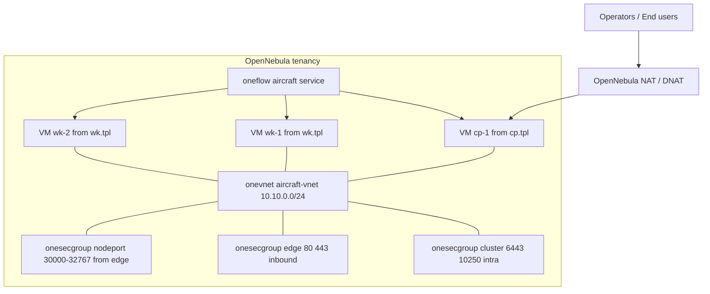
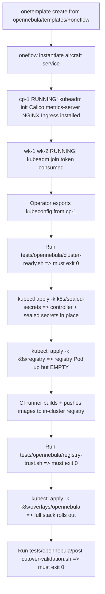

# OpenNebula Automation & Minikube-→-OpenNebula Cut-over Plan

> **Sibling document to** [`plans/deploy.md`](deploy.md). That plan deferred OpenNebula automation to a separate work item (its §2.2 + Phase D). **This is that work item.**
>
> **Trigger for writing this plan:** the manually-built 3-VM OpenNebula cluster of `deploy.md` §2.1 has been **torn down**. There is no longer a "validation cluster" the PaaS overlay can be exercised against. From now on, every `kubectl apply -k k8s/overlays/opennebula` run must target a cluster produced by the automation defined here.
>
> Consequence: this plan owns BOTH
>   1. the contents of the [`opennebula/`](../opennebula/) tree (templates, vNet, cloud-init, security groups, runbook), AND
>   2. the small set of [`k8s/`](../k8s/) refactors needed to leave the Minikube-coupled defaults behind now that the manual fallback cluster is gone.

---

## 1. Goals & non-goals

### Goals

1. Produce a **byte-equivalent replacement** for the §2.1 manual cluster from native OpenNebula primitives (`onetemplate` / `onevm` / `oneflow` / `onevnet` / `onesecgroup`) — **no Terraform, no Ansible**. The §2.2 sketch in [`plans/deploy.md`](deploy.md) is the verbatim target shape.
2. Make the cluster *reproducible*: a clean OpenNebula tenancy + this repo must yield a cluster that passes [`tests/opennebula/cluster-ready.sh`](../tests/opennebula/cluster-ready.sh) and [`tests/opennebula/registry-trust.sh`](../tests/opennebula/registry-trust.sh) with zero manual steps after `onetemplate instantiate`.
3. Decouple the k8s/* manifests from Minikube assumptions that are no longer load-bearing now that no manual cluster remains as a safety net.
4. Define a deterministic **first-boot sequence** that solves the chicken-and-egg between (a) the in-cluster Docker Registry and (b) the workloads that pull from it.

### Non-goals

- Production-grade OpenNebula HA (multi-front-end, raft datastore) — single OpenNebula front-end is fine for the brief.
- Production-grade Postgres / RabbitMQ — still out of scope (see [`plans/deploy.md`](deploy.md) §10).
- Multi-cluster / multi-region.
- Replacing the existing Calico choice with another CNI.

---

## 2. Current state after the tear-down

| Artefact | State | Implication |
|---|---|---|
| Manually-built §2.1 cluster | **Gone** | No longer a fallback validation target. |
| [`opennebula/README.md`](../opennebula/README.md) | Placeholder, points at this plan's deliverables | To be **replaced** by the real runbook + tree below. |
| [`tests/opennebula/cluster-ready.sh`](../tests/opennebula/cluster-ready.sh), [`tests/opennebula/registry-trust.sh`](../tests/opennebula/registry-trust.sh) | Shipped, never run against a live cluster | Become the **acceptance gate** for §6 below. |
| [`tests/opennebula/post-cutover-validation.sh`](../tests/opennebula/post-cutover-validation.sh) | **Missing** (referenced from `opennebula/README.md` but not present on disk) | Must be written as part of this plan. |
| [`k8s/overlays/opennebula/kustomization.yaml`](../k8s/overlays/opennebula/kustomization.yaml) | Production preset already in place: replicas=3, anti-affinity, real hostnames, registry FQDN, letsencrypt-staging | Stays as-is structurally — small additions in §4 only. |
| [`k8s/base/kustomization.yaml`](../k8s/base/kustomization.yaml) | Calls itself "Minikube-equivalent baseline" | Comment / framing must be updated; defaults stay Minikube-shaped because `overlays/minikube` still consumes them. |
| [`k8s/gateway/ingress.yaml`](../k8s/gateway/ingress.yaml), [`k8s/users/deployment.yaml`](../k8s/users/deployment.yaml), siblings | `*.localtest.me`, `<svc>:dev`, `imagePullPolicy: IfNotPresent` | Compatible with overlays/opennebula (already overridden). Audited for completeness in §4. |
| [`k8s/ci/runner-deployment.yaml`](../k8s/ci/runner-deployment.yaml) | DinD `--insecure-registry=registry.ns-registry.svc.cluster.local:5000` | Compatible. The new nodes' containerd must mirror this trust (§3.3). |

---

## 3. OpenNebula IaaS automation (the [`opennebula/`](../opennebula/) tree)

### 3.1 Final layout produced by this plan

```
opennebula/
├── README.md                          # replaces the current placeholder
├── runbook.md                         # `onetemplate create` / `onevm instantiate` walk-through
├── templates/
│   ├── cp.tpl                         # 2 vCPU, 4 GiB RAM, 40 GiB disk control-plane
│   └── wk.tpl                         # 4 vCPU, 8 GiB RAM, 40 GiB disk worker
├── vnet/
│   └── aircraft-vnet.tpl              # 10.10.0.0/24, L2-isolated, gateway via OpenNebula NAT
├── context/
│   ├── cloud-init.cp.yaml             # kubeadm init  + Calico apply + write join token to OpenNebula user data
│   └── cloud-init.wk.yaml             # kubeadm join  (reads token from user data) + containerd registry mirror
├── security-groups/
│   ├── cluster.tpl                    # 6443/tcp + 10250/tcp intra-cluster only
│   ├── edge.tpl                       # 80/443 only at the edge, source = anywhere
│   └── nodeport.tpl                   # 30000-32767/tcp from edge only
└── service/
    └── aircraft.oneflow.yaml          # oneflow service template wiring cp + wk roles with role dependency
```

### 3.2 IaaS resource map (mermaid)



Key shape decisions:

- **Role dependency expressed in `oneflow`**, not in cloud-init: workers `depends_on: [control-plane]` so OpenNebula won't instantiate `wk-*` until `cp-1` is `RUNNING`. This is what removes the manual "wait for the join token" step from the §2.1 runbook.
- **vNet isolated** at L2 from the public Internet except via the OpenNebula NAT for outbound (image pulls during cloud-init, Let's Encrypt ACME challenges) and a single inbound DNAT mapping `edge_ip:443` → `cp-1:443` for the Ingress controller (NGINX Ingress on the control-plane node — keeping the worker NodePort range firewalled at the edge).
- **Security groups stacked, not collapsed**: `cluster` + `edge` + `nodeport` are three distinct objects so the operator can swap `edge` without touching `cluster` (e.g. add a second edge for blue/green).

### 3.3 Cloud-init contract (the contract `cluster-ready.sh` enforces)

Each `cloud-init.*.yaml` is a deterministic, idempotent runbook. The contract every cluster must satisfy on boot:

| Step | `cp` | `wk` | Verified by |
|---|---|---|---|
| Disable swap, set `br_netfilter` + `overlay`, sysctl `net.bridge.bridge-nf-call-iptables=1` | ✓ | ✓ | implicit (kubeadm preflight) |
| Install containerd, kubeadm, kubelet, kubectl pinned to **v1.30.x** | ✓ | ✓ | [`tests/opennebula/cluster-ready.sh`](../tests/opennebula/cluster-ready.sh) §2 |
| `kubeadm init --pod-network-cidr=192.168.0.0/16 --control-plane-endpoint=<edge_ip>` | ✓ | — | [`cluster-ready.sh`](../tests/opennebula/cluster-ready.sh) §1 |
| Apply Calico manifest (Tigris operator + default IPPool 192.168.0.0/16) | ✓ | — | [`cluster-ready.sh`](../tests/opennebula/cluster-ready.sh) §3 |
| Write `kubeadm token create --print-join-command` to OpenNebula context user data so workers can read it | ✓ | — | implicit (workers come up Ready) |
| `kubeadm join` (token read from OpenNebula context) | — | ✓ | [`cluster-ready.sh`](../tests/opennebula/cluster-ready.sh) §1 |
| Drop `/etc/containerd/certs.d/registry.ns-registry.svc.cluster.local:5000/hosts.toml` with `skip_verify = true` and `capabilities = ["pull","resolve"]` | ✓ | ✓ | [`tests/opennebula/registry-trust.sh`](../tests/opennebula/registry-trust.sh) |
| Install `metrics-server` from manifest (kubelet TLS verification disabled — internal CA only) | ✓ | — | [`cluster-ready.sh`](../tests/opennebula/cluster-ready.sh) §5 |
| Apply NGINX Ingress controller manifest + `IngressClass` `nginx` | ✓ | — | post-cutover-validation.sh (new, §6.3) |

The cloud-init is **declarative, not scripted**: every step is a `runcmd` whose exit code is non-zero on failure so OpenNebula marks the VM `FAILURE`, not silently `RUNNING-with-broken-cluster`.

### 3.4 Image strategy on the OpenNebula side

- A single **Ubuntu 22.04 LTS marketplace image** is the base for both `cp.tpl` and `wk.tpl`. All version pinning lives in the contextualisation, not in the image — so the image can be updated independently of Kubernetes version bumps.
- The image is *not* prebaked with kubeadm/containerd. Rationale: pre-baking turns a "kubeadm minor version bump" into a "rebuild and re-upload the marketplace image" — too heavy. Cloud-init installs everything from `apt` mirrors during first boot; the cost (≈4 min per VM) is acceptable for a 3-node cluster.

---

## 4. k8s/* code changes required by the Minikube → OpenNebula move

The full inventory of files that need touching, with one-line rationale. Most are **comment / framing updates** rather than functional changes, because [`k8s/overlays/opennebula/kustomization.yaml`](../k8s/overlays/opennebula/kustomization.yaml) already does the heavy lifting. Functional changes are flagged **[FUNCTIONAL]**.

### 4.1 Inventory

| File | Change | Why |
|---|---|---|
| [`k8s/base/kustomization.yaml`](../k8s/base/kustomization.yaml) | Reword the "Minikube-equivalent baseline" header — keep the defaults, but explicitly call them "developer-loop baseline" so future readers don't assume Minikube is the production fallback. | Manual §2.1 cluster gone; "Minikube-equivalent" is now misleading. |
| [`k8s/users/deployment.yaml`](../k8s/users/deployment.yaml), [`k8s/fleet/deployment.yaml`](../k8s/fleet/deployment.yaml), [`k8s/booking/deployment.yaml`](../k8s/booking/deployment.yaml) | **[FUNCTIONAL]** change `imagePullPolicy` from `IfNotPresent` → `IfNotPresent` *only* in `overlays/minikube`, force `Always` on `overlays/opennebula`. Add an overlay patch. | OpenNebula nodes don't have a `minikube docker-env` preload — without `Always` they may run a stale local copy of a tag (`latest`, or a sha-tag re-pushed by CI). |
| Same three Deployments | Add overlay patch setting `image: registry.ns-registry.svc.cluster.local:5000/<svc>:latest` — already covered by the overlay's `images:` rewrite; **no source change**, audit only. | Verified — overlay covers it. |
| [`k8s/users/migration-job.yaml`](../k8s/users/migration-job.yaml), [`k8s/fleet/migration-job.yaml`](../k8s/fleet/migration-job.yaml), [`k8s/booking/migration-job.yaml`](../k8s/booking/migration-job.yaml) | **[FUNCTIONAL]** extend the existing `images:` rewrite in `overlays/opennebula` to also rewrite the migration-job container images (currently only the Deployment images are rewritten — Jobs would silently pull the unqualified `<svc>:dev` tag). | Gap discovered while writing this plan. |
| [`k8s/frontend/deployment.yaml`](../k8s/frontend/deployment.yaml) | Audit only — overlay rewrites `vue-frontend:dev` correctly. | Verified. |
| [`k8s/gateway/ingress.yaml`](../k8s/gateway/ingress.yaml) | **[FUNCTIONAL]** the inline CSP `connect-src` whitelist hard-codes `*.aircraft.localtest.me`. The overlay rewrites `spec.tls[*].hosts[0]` and `spec.rules[*].host` but **does not** rewrite the annotation body. Add an overlay patch that rewrites the `nginx.ingress.kubernetes.io/configuration-snippet` annotation to use `*.aircraft.example.com` instead. | Without this, the SPA running on `https://app.aircraft.example.com` cannot XHR to `https://users.aircraft.example.com` — the browser blocks on the wrong CSP. |
| [`k8s/registry/auth-secret.yaml`](../k8s/registry/auth-secret.yaml) | **[FUNCTIONAL]** rotate `ciuser:ciuser` to a real bcrypt-generated password committed only as a SealedSecret. Replace the plaintext fall-back in this file with a `# THIS FILE IS A TEMPLATE; opennebula overlay deletes it` header and have the overlay's `patches:` remove it. | The §2.1 manual cluster could afford the plaintext baseline because it never hosted real images; the automation-built cluster does, and the placeholder is now a real credential leak. |
| [`k8s/registry/deployment.yaml`](../k8s/registry/deployment.yaml) | Audit only — single replica is acceptable; the `Recreate` strategy + PVC already match what cloud-init's containerd config expects. | Verified. |
| [`k8s/infra/postgres.yaml`](../k8s/infra/postgres.yaml), [`k8s/infra/rabbitmq.yaml`](../k8s/infra/rabbitmq.yaml) | Audit only — StatefulSet + PVC stays as-is. Confirm the OpenNebula default StorageClass name matches what `volumeClaimTemplates` requests (or add an overlay patch setting `storageClassName`). | OpenNebula's bundled `csi-driver` typically registers `oneblock` as the SC; the manifests use the cluster default which is fine if cloud-init annotates it `storageclass.kubernetes.io/is-default-class: "true"`. |
| [`k8s/ci/runner-deployment.yaml`](../k8s/ci/runner-deployment.yaml) | Audit only — DinD `--insecure-registry` already trusts the in-cluster registry. The same trust is wired on the nodes by cloud-init (§3.3). | Verified. |
| [`k8s/overlays/opennebula/kustomization.yaml`](../k8s/overlays/opennebula/kustomization.yaml) | **[FUNCTIONAL]** add the four patches identified above: (a) migration-job image rewrite, (b) `imagePullPolicy: Always`, (c) Ingress CSP rewrite, (d) delete `k8s/registry/auth-secret.yaml` (replaced by SealedSecret). | All four are the only material k8s/* code changes the move requires. |
| [`k8s/overlays/minikube/kustomization.yaml`](../k8s/overlays/minikube/kustomization.yaml) | Audit only — unchanged. The Minikube overlay remains for the dev loop. | Verified. |

### 4.2 What this plan deliberately does NOT change

- **[`k8s/base/namespaces.yaml`](../k8s/base/namespaces.yaml)** — `ns-frontend` and `ns-registry` are already labelled.
- **[`k8s/network-policies/`](../k8s/network-policies/)** — default-deny + per-namespace `allow-*.yaml` already correct; reused as-is.
- **[`k8s/sealed-secrets/`](../k8s/sealed-secrets/)** — controller manifest stays; only one new sealed secret is added (`registry-auth-sealedsecret.yaml` already exists, just promoted to required).
- **Hostnames** — already `aircraft.example.com` in the overlay.

---

## 5. First-boot / cut-over sequence

### 5.1 Bootstrap order (mermaid)



### 5.2 Resolving the registry chicken-and-egg

The new cluster has no manual fallback — so the workloads' image references all point at `registry.ns-registry.svc.cluster.local:5000` from second one. But the registry itself starts empty.

Resolution: **break the dependency by deploying in two waves**, codified in §5.1 above:

1. **Wave 1 — control-plane resources only**: `k8s/sealed-secrets/` (controller is from a public image), `k8s/registry/` (registry itself is `registry:2` from Docker Hub, pulled via NAT). At the end of Wave 1, the registry is up and reachable but has zero images.
2. **CI build step** runs from the self-hosted runner Pod (already wired in [`k8s/ci/runner-deployment.yaml`](../k8s/ci/runner-deployment.yaml)). DinD builds the four service images, pushes to the in-cluster registry. The runner Pod itself runs `myoung34/github-runner` from Docker Hub via NAT — no chicken-and-egg there either.
3. **Wave 2 — application overlay**: `kubectl apply -k k8s/overlays/opennebula/` now succeeds because every referenced image is present in the registry.

This is what makes the cluster *idempotent on rebuild*: tearing down and re-instantiating the `oneflow` service reproduces the cluster, and replaying the same CI runs reproduces the workloads.

### 5.3 Kubeconfig handoff

- `kubeadm init` writes `/etc/kubernetes/admin.conf` on `cp-1`. The cloud-init copies it (with the `server:` field rewritten to `https://<edge_ip>:6443`) to OpenNebula's contextualisation user-data so the operator can `onevm show cp-1 --user-data` and extract it. No SSH required.
- The same kubeconfig is base64'd into GitHub Actions' `KUBE_CONFIG` secret (already referenced by [`plans/deploy.md`](deploy.md) §4.2). Rotating the cluster = rotating that secret only.

---

## 6. Acceptance gates

Each gate is a script that **must exit 0** before the next gate is attempted. No gate may be skipped.

| Gate | Script | What it proves |
|---|---|---|
| §6.1 Cluster ready | [`tests/opennebula/cluster-ready.sh`](../tests/opennebula/cluster-ready.sh) (already shipped) | 3 nodes Ready, Calico DaemonSet healthy, CoreDNS up, metrics-server present, k8s v1.30.x, edge endpoint reachable. |
| §6.2 Registry trust | [`tests/opennebula/registry-trust.sh`](../tests/opennebula/registry-trust.sh) (already shipped) | Every worker's containerd treats `registry.ns-registry.svc.cluster.local:5000` as a trusted insecure mirror AND live-fire pull succeeds. |
| §6.3 Post-cutover validation | `tests/opennebula/post-cutover-validation.sh` **(to be written)** | End-to-end: HTTPS works via the edge, `users` / `fleet` / `booking` `/health` return 200 over Ingress, RabbitMQ consumer is connected, Postgres reachable from each app namespace ONLY, HPAs report non-`<unknown>` targets. |
| §6.4 Network-policy chaos | [`tests/k8s/network-policy.sh`](../tests/k8s/network-policy.sh) (already shipped) | Cross-namespace traffic without the matching `name: ns-xxx` label is dropped. |

A new [`docs/opennebula-cutover.md`](../docs/opennebula-cutover.md) operator runbook captures the exact `kubectl` / `onevm` invocations for each gate (referenced from [`opennebula/README.md`](../opennebula/README.md) but not yet present on disk).

---

## 7. Risks & mitigations

| Risk | Mitigation |
|---|---|
| `kubeadm join` token expires (24 h default) before workers boot — `oneflow` role dependency usually masks it, but a paused wk role would miss the window. | Cloud-init on `cp-1` runs `kubeadm token create --ttl 0 --print-join-command` for the workers' read path (non-expiring token, acceptable because the vNet is L2-isolated and the token is held in encrypted OpenNebula user data). |
| Calico MTU mismatch on the OpenNebula vNet (OpenNebula's bridge may use 1500, Calico defaults to 1480) → intermittent TCP stalls. | Cloud-init pins `FELIX_MTU=1450` (50 bytes below 1500 to account for VXLAN). Tested via `kubectl exec` ping-with-DF in `post-cutover-validation.sh`. |
| OpenNebula NAT blocks outbound `apt` or Docker Hub mid-cloud-init → cluster comes up half-broken. | `runcmd` exit codes are checked; OpenNebula marks the VM `FAILURE` instead of `RUNNING`. `cluster-ready.sh` doubles as the operator-facing detector. |
| In-cluster registry on plain HTTP is acceptable inside the vNet, but a misconfigured node falls back to TLS verification and silently fails to pull. | `registry-trust.sh` does **live-fire pulls per node**, not just config inspection. |
| Edge DNAT only maps `:443` but the operator forgets `:80` for the ACME HTTP-01 challenge → Let's Encrypt issuance fails. | Edge security group [`opennebula/security-groups/edge.tpl`](../opennebula/security-groups/edge.tpl) opens BOTH `:80` and `:443`; cluster-ready.sh probes both. |
| The §5.2 chicken-and-egg recurs if someone re-orders Kustomize apply steps. | The cut-over runbook in [`docs/opennebula-cutover.md`](../docs/opennebula-cutover.md) (to be written) hardcodes the two-wave order; CI replays it identically every deploy. |
| Plaintext `ciuser:ciuser` registry password in [`k8s/registry/auth-secret.yaml`](../k8s/registry/auth-secret.yaml) leaks now that the registry holds real images. | §4.1 marks the file as **[FUNCTIONAL]** removed from the `overlays/opennebula` build, replaced by [`k8s/sealed-secrets/registry-auth-sealedsecret.yaml`](../k8s/sealed-secrets/registry-auth-sealedsecret.yaml). |

---

## 8. Out of scope (deliberately)

- OpenNebula HA / Raft datastore.
- Backup of the OpenNebula tenancy itself (templates are in Git; data lives on PVCs whose backup is `plans/deploy.md` §10's job).
- An OpenNebula Marketplace appliance — the templates here are tenancy-local, not a redistributable appliance.
- Cilium / other CNI evaluation — Calico stays.
- Terraform / Ansible providers — explicitly rejected per the answer to the §1 framing question; only `onetemplate` / `onevm` / `oneflow` / `onevnet` / `onesecgroup` are used.

---

## 9. Cross-references back to [`plans/deploy.md`](deploy.md)

- This plan **fulfils** `deploy.md` §2.2 (deferred OpenNebula automation deliverables).
- This plan **executes** `deploy.md` §8 Phase D (cut-over).
- `deploy.md` Phases A → C → E stay authoritative for the **PaaS**, **CI/CD**, **security**, and **validation** layers — this plan does not duplicate them, only adapts the four files §4.1 calls out.
- Once this plan ships, [`opennebula/README.md`](../opennebula/README.md) loses its "placeholder" banner and becomes the operator entry-point; the deferred-work note in `deploy.md` §2.2 should be replaced with a one-line "see [`plans/opennebula.md`](opennebula.md)".
